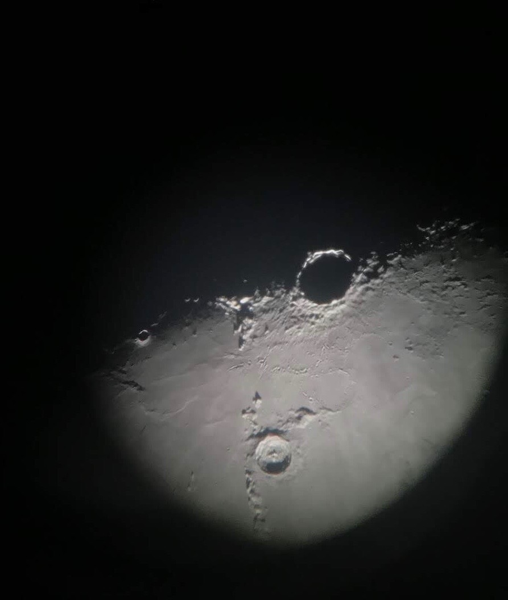

# McDonald Observatory Status Tracker

This tracker sends users an email detailing whether or not the [McDonald Observatory](https://mcdonaldobservatory.org/) has re-opened to visitors, and notifies users of any new press releases. 

## Getting Started

1. `git clone`
2. `cd mcdonald_obs_tracker`
3. Find the **config_example.ini** file in the **/ref** folder, and rename it to **config.ini**. Fill in the senders email address and secret key .Fill in the recipients email address.  
3. `python email_driver.py`

